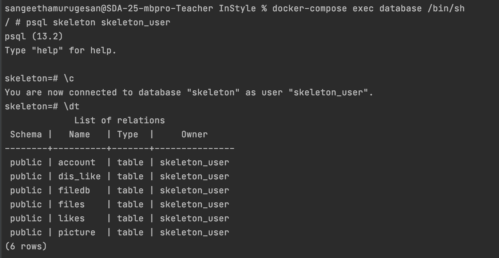
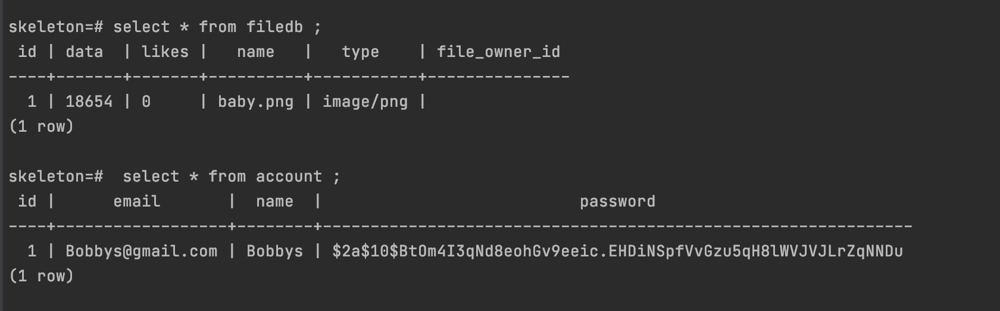

## InStyle

## Introduction
This application is a Social Media Application for Stylists built with gradle.
The social media era is well and truly underway and photo sharing app is one
of the biggest hot topic social platforms.This application is for Style Competition.Every user in our app is a stylist.
Every user can submit their styles (photo) and they can vote for other user's styles.Everyday we have a
winner who has the highest number of (likes) votes.
He/She can decide best styles and vote for it.

## Getting Started
The web application is made up of three parts: database, backend  (Spring)
and frontend (React).The application can run directly via Gradle. The code for this
application uses the Gradle build tool (https://gradle.org.).Instructions for
installing Gradle are available in the official documentation(https://gradle.org/install)
which describes several options.

Getting started is simple. The User have to register and login.

1.Create a username and password.
2.Fill in your profile information.
3.You can upload images to your Instyle profile right away.
4.You can like other users’ photos by tapping the fire icon.
That’s it, you’re all set to start posting some great images and ready for Style
competition.

## Front-end React
Front-end for this application is built with Create React App.

```sh
npx create-react-app my-app
cd frontend
npm install 
npm start 

```

_If you've previously installed `create-react-app` globally via `npm install -g create-react-app`, its recommended to uninstall the package using `npm uninstall -g create-react-app` or `yarn global remove create-react-app` to ensure that npx always uses the latest version._

_[npx](https://medium.com/@maybekatz/introducing-npx-an-npm-package-runner-55f7d4bd282b) comes with npm 5.2+ and higher._

_Then open [http://localhost:3000/](http://localhost:3000/) to see the application.<br>_


## How to Run the Application
The application can also be run via terminal with the Gradle.

```
./gradlew bootRun
```
To Stop Running the Application:

```
Crtl + C
```
## Setup
We need to configure the following dependencies in `build.gradle`:

```Dependencies:
plugins {
    id 'org.springframework.boot' version '2.2.0.RELEASE'
    id 'io.spring.dependency-management' version '1.0.8.RELEASE'
    id 'java'
}

group = 'se.kth.sda'
version = '0.0.1-SNAPSHOT'
sourceCompatibility = '11'

configurations {
    developmentOnly
    runtimeClasspath {
        extendsFrom developmentOnly
    }
}

repositories {
    mavenCentral()
}

dependencies {
    implementation 'org.springframework.boot:spring-boot-starter-data-jpa'
    implementation 'org.springframework.boot:spring-boot-starter-security'
    implementation 'org.springframework.boot:spring-boot-starter-thymeleaf'
    implementation 'org.springframework.boot:spring-boot-starter-web'
    developmentOnly 'org.springframework.boot:spring-boot-devtools'
    compile group: 'com.auth0', name: 'java-jwt', version: '3.8.3'
    implementation group: 'commons-io', name:'commons-io', version:'2.6'
    runtimeOnly 'org.postgresql:postgresql'
}
```

`src/main/resources/application.properties` should be configured:
```properties
spring.jpa.database=POSTGRESQL
spring.datasource.platform=postgres
spring.datasource.url=jdbc:postgresql://localhost:5431/skeleton
spring.datasource.username=skeleton_user
spring.datasource.password=skeleton_pass
spring.jpa.show-sql=true
spring.jpa.generate-ddl=true
spring.jpa.hibernate.ddl-auto=create
spring.jpa.properties.hibernate.jdbc.lob.non_contextual_creation=true
spring.servlet.multipart.max-file-size=300MB
spring.servlet.multipart.max-request-size=300MB

spring.jpa.properties.hibernate.dialect= org.hibernate.dialect.PostgreSQLDialect
```
## DataBase Setup
A Dockerized PostgreSQL database:

The docker-compose.yaml is manually created.
To create docker-compose from the terminal ,we need to use the command
```touch docker-compose.yaml ```

and docker-compose.yaml should contain the following.
```docker-compose.yaml
version: "3"
services:
  database:
    image: postgres:13-alpine
    environment:
       - POSTGRES_DB=skeleton 
       - POSTGRES_USER=skeleton_user
       - POSTGRES_PASSWORD=skeleton_pass
    ports:
      - "5431:5432"
    volumes:
      - db-data:/var/lib/postgresql/data

volumes:
  db-data:
```

## Docker Commands
1.Start container
```
docker-compose up
```
2.Stop container
```
docker-compose down
```
3.List all Running Containers
```
docker ps
```
4.Enter the Running Container
```
docker-compose exec database /bin/sh
```
5.(psql Commands) While inside a postgres container, enter the postgres database.
```
psql skeleton skeleton_user
```
6.psql Commands (when inside the database)
Connect to DataBase:
```bash
\c
```
7.Show the tables in the database
```bash
\dt
```
8.Show all rows in particular table
```
SELECT * FROM account;
```

## Usage
After logging in,the User can view the winner of the day and the user can follow
the winner by clicking  the follow option in Winner page and the user can fill their profile
information with uploading profile picture and submit a new style from the profile page.
The Users can view other user's styles in Discover page and like by clicking the FIRE
icon and dislike by clicking the NAAAH icon.The User can also vote for the styles
in vote page by clicking FIRE icon.Every user can decide the best styles and vote for it.The style with
highest number of votes (likes) is the selected as a winner by the end of the day and winner's photo will
be displayed in winner page.

### User API EndPoints
The User's are able to create new account ,Sign In new account.

| HTTP Method | HTTP Path | Action |
| ------------|-----------|--------|
| `POST`    |  `/register`     | Create new account. |
| `POST`    | `/authenticate` | Authenticate User. |


### File (Picture API)
The Users are Upload a File (Picture) ,View all pictures,Delete a picture.

Below are the End-points:

| HTTP Method | HTTP Path | Action |
| ------------|-----------|--------|
| `GET`    | `/files/{id}` | Get picture by ID. |
| `GET`    | `/picture/{userId}` | Get all pictures for specific user. |
| `POST`    |  `/upload`     | Upload a picture. |
| `POST`    |  `/upload{userId}`     | Upload a picture for specific user. |
| `DELETE` | `/files/{id}` | delete the picture by ID. |

### Profile Picture

The Users are Upload a Profile Picture,View profile picture.

| HTTP Method | HTTP Path | Action |
| ------------|-----------|--------|
| `GET`    | `/profile-picture/{userId}` | Get profile picture by user ID . |
| `POST`    | `upload-profile-picture/{userId}` | Adding profile picture by user ID. |

### Like API

The Users are able to like the pictures,disLike the picture,View number of likes for specfic picture,
View number of disLikes for specfic picture.


| HTTP Method | HTTP Path | Action |
| ------------|-----------|--------|
| `GET` | `/likes/{fileId}` |  Get likes of a specific picture |
| `GET` | `/dislikes/{fileId}` |  Add a dislike to a picture |
| `POST`    |  `/likes/{fileId}`     | Add a like to a picture |
| `POST`    |  `/dislikes/{fileId}`     | Add a dislike to a picture |


## FrontEnd ScreenShots

## Winner Page


## Profile Page


## Discover Page


## Landing Page


## Voting Page


## DataBase ScreenShots

## Running the Containers,Entering the Postgres DataBase and Connecting to DB to view the DB tables.



## To view all the rows in the particular table (account,filedb)




