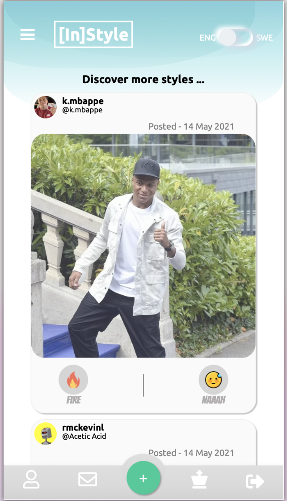

## Introduction
This application is a Social Media Application for Stylists built with gradle.

The social media era is well and truly underway and photo sharing app is one
of the biggest hot topic social platforms.This application is for Style Competition.Every user in our app is a stylist.
Every user can have his/her own profile,submit their styles and they can vote for other user's styles.Everyday we have a
Current King (Winner) who has the highest number of (likes) votes and the user can follow the current king.
He/She can decide best styles and vote for it.The user can translate the application from English to Swedish and 
vice versa.The user's can comment on styles.

## Getting Started
The web application is made up of three parts: database, backend  (Spring)
and frontend (React).The application can run directly via Gradle. The code for this
application uses the Gradle build tool (https://gradle.org.).

Getting started is simple. The User have to register and login.

1.Create a username and password.
2.Fill in your profile information.
3.You can translate the application from English to Swedish and vice versa.
4.You can upload images to your InStyle profile right away.
5.You can like other users’ photos by tapping the FIRE icon and dislike
the styles by tapping NAAAH icon.
6.You can vote other users’ styles by tapping the FIRE icon.
7.You can comment other users’ styles.
That’s it, you’re all set to start posting some great images and ready for Style
competition.

## Front-end React
Front-end for this application is built with Create React App.

```sh
npx create-react-app InStyle
```

```sh
cd frontend
npm install 
npm start 

```
 The User can open [http://localhost:3000/](http://localhost:3000/) to see the application.

## How to Run the Application
The application can also be run via terminal with the Gradle.

```
./gradlew bootRun
```
To Stop Running the Application:

```
Crtl + C
```
## Setup
We need to configure the following dependencies in `build.gradle`:

```Dependencies:
plugins {
    id 'org.springframework.boot' version '2.2.0.RELEASE'
    id 'io.spring.dependency-management' version '1.0.8.RELEASE'
    id 'java'
}

group = 'se.kth.sda'
version = '0.0.1-SNAPSHOT'
sourceCompatibility = '11'

configurations {
    developmentOnly
    runtimeClasspath {
        extendsFrom developmentOnly
    }
}

repositories {
    mavenCentral()
}

dependencies {
    implementation 'org.springframework.boot:spring-boot-starter-data-jpa'
    implementation 'org.springframework.boot:spring-boot-starter-security'
    implementation 'org.springframework.boot:spring-boot-starter-thymeleaf'
    implementation 'org.springframework.boot:spring-boot-starter-web'
    developmentOnly 'org.springframework.boot:spring-boot-devtools'
    compile group: 'com.auth0', name: 'java-jwt', version: '3.8.3'
    implementation group: 'commons-io', name:'commons-io', version:'2.6'
    runtimeOnly 'org.postgresql:postgresql'
}


test {
    useJUnitPlatform()
}
```

`src/main/resources/application.properties` should be configured:
```properties
spring.jpa.database=POSTGRESQL
spring.datasource.platform=postgres
spring.datasource.url=jdbc:postgresql://localhost:5431/skeleton
spring.datasource.username=skeleton_user
spring.datasource.password=skeleton_pass
spring.jpa.show-sql=true
spring.jpa.generate-ddl=true
spring.jpa.hibernate.ddl-auto=create
spring.jpa.properties.hibernate.jdbc.lob.non_contextual_creation=true
spring.servlet.multipart.max-file-size=300MB
spring.servlet.multipart.max-request-size=300MB

spring.jpa.properties.hibernate.dialect= org.hibernate.dialect.PostgreSQLDialect
```
## DataBase Setup
A Dockerized PostgreSQL database:

The docker-compose.yaml is manually created.
To create docker-compose from the terminal ,we need to use the command
```touch docker-compose.yaml ```

and docker-compose.yaml should contain the following.
```docker-compose.yaml
version: "3"
services:
  database:
    image: postgres:13-alpine
    environment:
       - POSTGRES_DB=skeleton 
       - POSTGRES_USER=skeleton_user
       - POSTGRES_PASSWORD=skeleton_pass
    ports:
      - "5431:5432"
    volumes:
      - db-data:/var/lib/postgresql/data

volumes:
  db-data:
```

## Docker Commands

```bash
docker-compose up
docker ps
docker-compose exec database /bin/sh
psql skeleton skeleton_user
\c
\dt
SELECT * FROM account;
```
## Usage
After logging in, the User can view the Current King (Winner) of the day and the user can follow
the Current King by clicking  the follow option in Current King page and The User can navigate from one page to another
by clicking the appropriate Page link in the side bar.The User can also view the winner's profile by clicking Current 
King link in CurrentKing Page. The User can also view CurrentKing's instagram profile by clicking his/her profile name 
with @Symbol.The User can also translate the application fron English to Swedish and vice versa.

The user can fill their profile information with uploading profile picture and submit a new style from the profile page.
The Users can view other user's styles in Discover page and like by clicking the FIRE
icon and dislike by clicking the NAAAH icon.The User can also vote for the styles
in vote page by clicking FIRE icon.The user's cannot vote for their own styles.Instead they can vote for other styles.
The Every user can decide the best styles and vote for it.The style with
highest number of votes (likes) is the selected as a Winner by the end of the day and Winner's photo will
be displayed in Current King page.The user's can comment on styles and also user's can delete the comment.

The User can view the total Likes and DisLikes as OverAllScore in ProfilePage.

The User can also upload pictures by clicking (+) icon in the footer and contact the InStyle by clicking Envelope icon.
The User can view CurrentKing by clicking ChessKing icon and View his/her own profile by clicking the User icon.
The User can also logout by clicking the SignOut icon in footer.

## List of FrontEnd Components

| FrontEnd Components |
| ------------|
| `1.Card`    | 
| `2.CardDrawer`    | 
| `3.Comments`    | 
| `4.CountDownComponent`    | 
| `5.EditProfileButton`    | 
| `6.Footer`    | 
| `7.HeaderBackground`    | 
| `8.LandingOverlay`    | 
| `9.Navbar`    | 
| `10.Popup`    | 
| `11.ProfileCard`    | 
| `12.SlidingMenu`    | 
| `13.ToggleLanguage`    | 
| `14.UploadButton`    | 
| `15.UploadForm`    | 
| `16.UploadWidget`    | 
| `17.UserMeta`    | 
| `18.VoteComponent`    | 

### Auth API EndPoints
The User's are able to create new account ,Sign In new account.

| HTTP Method | HTTP Path | Action |
| ------------|-----------|--------|
| `POST`    | `/register` | Create new account. |
| `POST`    | `/authenticate` | Authenticate User. |

### User API EndPoints
| HTTP Method | HTTP Path | Action |
| ------------|-----------|--------|
| `PUT`    | `/current-user` | Update current username. |
| `GET`    | `/current-user` | Get the current user. |
| `GET`    |  `/users`     | Get all users. |

### Picture API EndPoints
| HTTP Method | HTTP Path | Action |
| ------------|-----------|--------|
| `Post`    | `/picture-url` | Post a picture to the current user by just providing the url. |
| `Post`    | `/picture` | Post a picture to the current user. |
| `Post`    |  `/picture-url/{userId}`     | Post a picture by userId by just providing url. |
| `Post`    | `/picture/{userId}` | Post a picture by userId |
| `Post`    | `/likes/{pictureId}` | Add a like to a picture. |
| `Post`    |  `/dislikes/{pictureId}`     | add a dislike to a picture |

| HTTP Method | HTTP Path | Action |
| ------------|-----------|--------|
| `GET`    | `/files/{id}` | Get picture by ID. |
| `GET`    | `/files` | Get all pictures. |
| `POST`    |  `/upload`     | Upload a picture. |
| `DELETE` | `/files/{id}` | Delete the picture by ID. |

### Comment API EndPoints
| HTTP Method | HTTP Path | Action |
| ------------|-----------|--------|
| `POST`    | `/picture/{pictureId}/comment` | Add comment to picture by Id. |
| `GET`    | `/comments/{pictureId}` | Get comments of a picture by Id. |
| `GET`    |  `/comments`     | Get all comments. |
| `DELETE` | `/comments/{commentId}` | Delete a comment by his ID. |

## ScreenShots
## Login Page


##  Current King Page


## Profile Page


## Discover Page



## Vote Page


